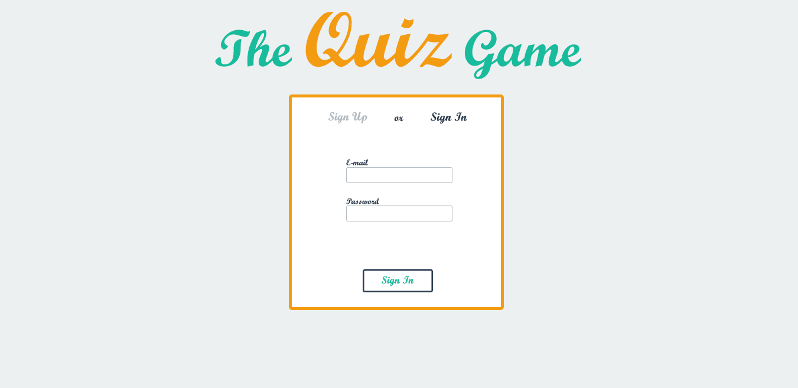
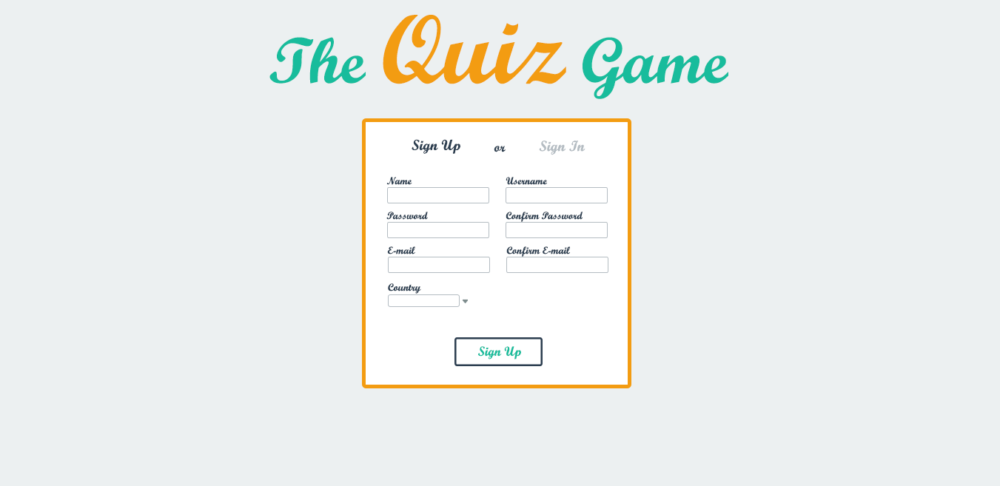
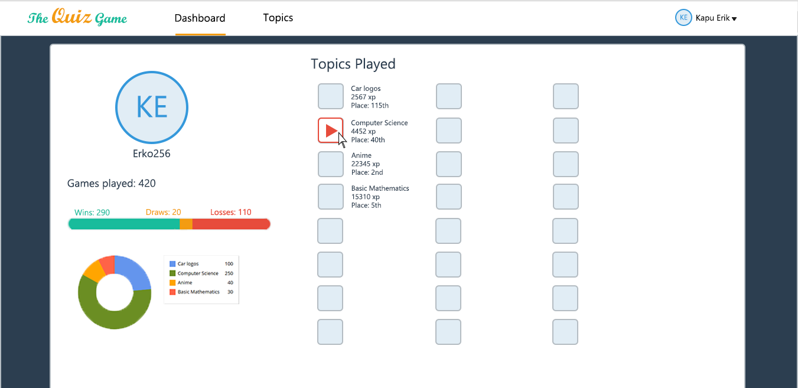
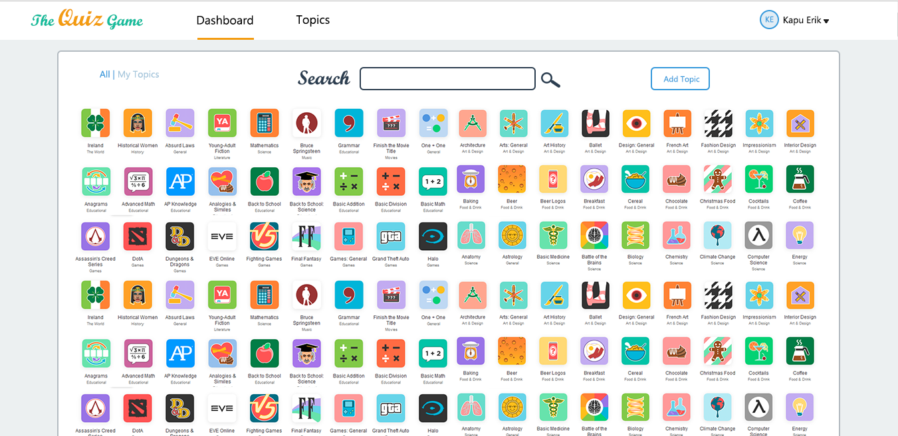
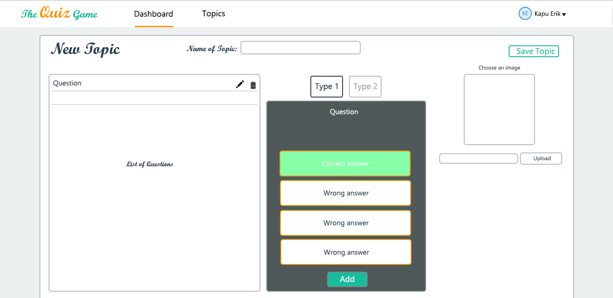
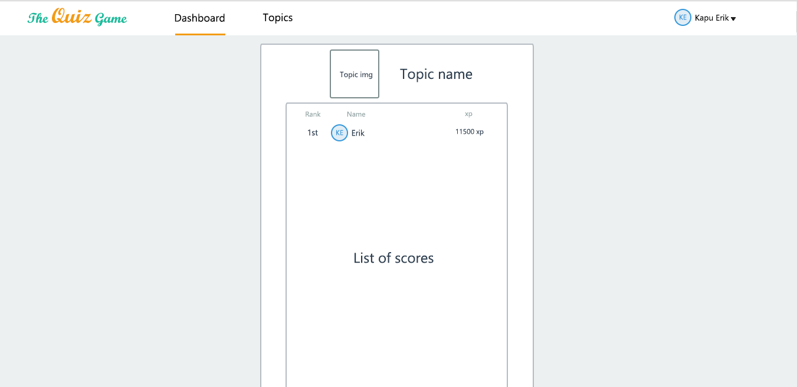
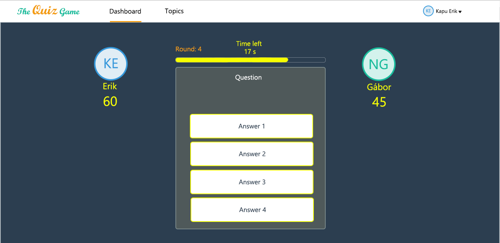
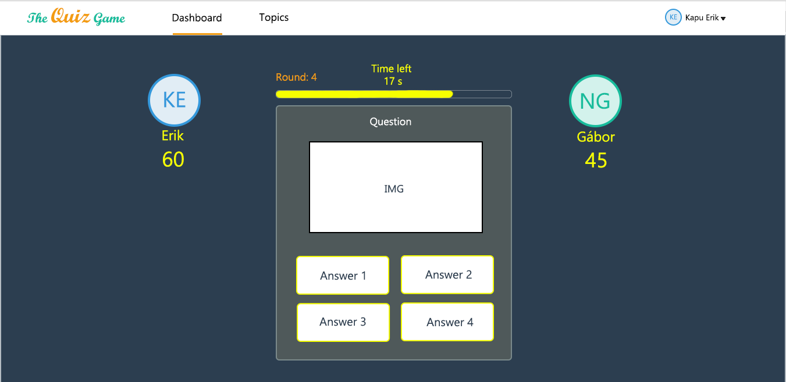
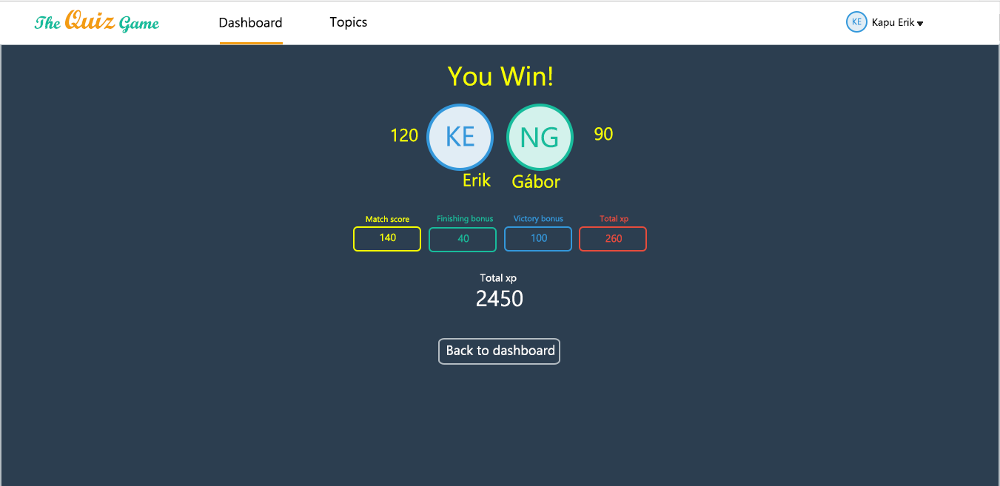

# TheQuizGame
Online multiplayer quiz game written in JavaScript. 

https://theqgame.herokuapp.com/

## Design:

## XP system
After each game you are rewarded with experience points (XP) based on your performance in the game. Maximum points for each game are 300 XP. The points earned are the sum of:

- Match score: the points you get for your right answered questions, the faster you answer the more points you get (maximum 160)
- Finish bonus: you are rewarded with 40 XP if you finish the game 
- Victory bonus: you are rewarded with 100 XP if you win the game

If your game ends in a tie, you share the victory bonus with your opponent (you get 50 XP each).

## Elképzelés

- Legyen lehetőség regisztrációra és belépésre, maga az alkalmazás csak a belépést követően legyen elérhető. 
- A belépést követően a dashboardra navigál, ahol megjelenítésre kerül a profilkép, nicknév, a játékstatisztika, valamint az eddig játszott topikok listája.
- Az itt felsorolt topikok ikonjára kattintva elindul a játék az adott topik témájában, az ikon melletti területre kattintva pedig a topik rangsortáblázata navigál, ez legyen az egyetlen módja a rangsortábla elérésének. 
- A Topicks oldalon érhető el az összes topik, ahol lehetőség van topik keresésére, új topik hozzáadására, saját topikokra szűrésre, amelyeket törölhetünk, vagy szerkeszthetünk. 